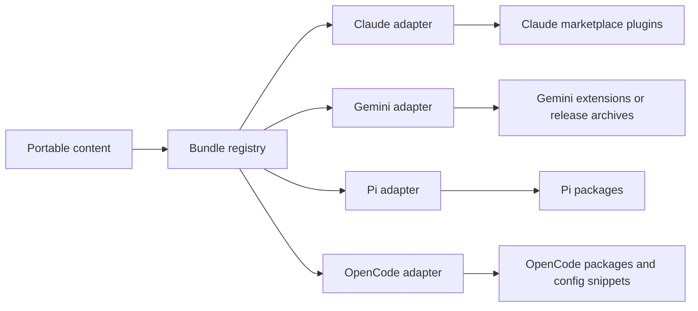

# Architecture

This repository exists to manage reusable agent extensions across four different host CLIs:

- Claude Code
- Gemini CLI
- pi.dev
- OpenCode

These tools are similar in intent, but they do not share a common packaging or marketplace standard. The architecture in this repository treats that as a first-class constraint.

## Problem Statement

We want a single source of truth for reusable agent behavior that can be installed by users of multiple coding agents.

What is portable across hosts:

- Skills written as `SKILL.md` (managed in [`nq-rdl/agent-skills`](https://github.com/nq-rdl/agent-skills), consumed here as a git submodule)
- Prompt content
- Reference material
- Some MCP-backed integrations
- Bundle metadata and release metadata

What is authored in this repo and packaged per host:

- Hooks
- MCP server configurations
- ACP integrations
- Host-specific plugin or extension wiring

What is not reliably portable:

- Hook models
- Permission models
- Runtime plugin code
- Command formats
- Marketplace and install semantics
- Update and governance controls

Because of that, this repository should not try to force a universal plugin format. It should manage a shared catalog of extensions and produce host-native outputs, consuming skills from the submodule by symlink.

## Core Decision

The repository uses this model:



The shared abstraction is:

- one catalog
- one bundle registry
- one skills submodule (`nq-rdl/agent-skills`) consumed by symlink
- authored extensions (hooks, MCP, ACP, prompts) in this repo
- multiple native distribution targets

## Platform Nuances

### Claude Code

Claude Code is the most marketplace-native of the four.

- Native install unit: plugin
- Native catalog unit: marketplace
- Good fit for monorepos: yes
- Skills: first-class
- Hooks: first-class and event-rich
- Governance: strong support for allowlists, managed settings, and seeded caches

Implication:

Claude should be treated as the reference marketplace model. Relative-path or `git-subdir` plugin distribution works well for monorepo-managed bundles.

### Gemini CLI

Gemini CLI is extension-native, not marketplace-native.

- Native install unit: extension
- Native discovery model: public gallery crawler over extension repos
- Good fit for monorepos: weaker than Claude and pi
- Skills: supported
- Hooks: supported
- Packaging expectation: self-contained repo or release archive with `gemini-extension.json` at the root

Implication:

Gemini is the main structural mismatch. A central catalog can still exist in this repo, but published Gemini artifacts usually need to become either:

- dedicated extension repos, or
- self-contained release archives

### pi.dev

pi.dev is package-native.

- Native install unit: package
- Native source types: npm, git, URL, local path
- Good fit for monorepos: yes
- Skills: supported
- Distribution model: package manager semantics rather than marketplace catalog semantics

Implication:

For pi, the package is the install boundary. A marketplace can exist as a documentation and discovery layer, but native installs should remain npm or git based.

### OpenCode

OpenCode is the least marketplace-shaped.

- Native install model: local config plus plugins, tools, agents, or npm packages
- Runtime extension model: JS or TS plugin code and `opencode.json`
- Good fit for monorepos: yes, if packaged around Bun or npm
- Skills: not the same first-class portable primitive as Claude, Gemini, and pi
- Hooks: implemented through plugin code, not shell hook configuration

Implication:

OpenCode should be treated as package plus config generation, not as a first-class marketplace target.

## Comparison Summary

| Tool | Native install unit | Native marketplace? | Monorepo-friendly | Best publication shape |
| --- | --- | --- | --- | --- |
| Claude Code | Plugin | Yes | Yes | Marketplace repo with plugin entries |
| Gemini CLI | Extension | Not really | Limited | Dedicated repo or release archive per extension |
| pi.dev | Package | Not really | Yes | npm or git package |
| OpenCode | Package/config/plugin | Not really | Yes | npm package plus generated config |

## Proposed Repository Model

The repository should evolve toward this layout:

```text
docs/
  ARCHITECTURE.md
  bundles.md

skills/                    ← git submodule (nq-rdl/agent-skills)

hooks/                     ← hook definitions authored in this repo
mcp/                       ← MCP server integrations authored in this repo
prompts/                   ← prompt content authored in this repo

registry/
  bundles/
    swe.yaml
    infra.yaml
    dataops.yaml
    informatics.yaml
    dev-tools.yaml
    meta.yaml
  channels/
    stable.yaml
    preview.yaml

.claude-plugin/
  marketplace.json         ← Claude Code marketplace manifest (repo root)

plugins/                   ← Claude Code plugins (one per bundle)
  swe/
    .claude-plugin/
      plugin.json
    skills/
      tdd -> ../../../skills/skills/tdd         ← symlink into submodule
      go-secure -> ../../../skills/skills/go-secure

gemini/                    ← Gemini CLI extension (all skills in one extension)
  gemini-extension.json
  GEMINI.md
  skills/
    tdd -> ../../skills/skills/tdd              ← symlink into submodule
    ansible -> ../../skills/skills/ansible
  templates/
  scripts/

pidev/                     ← pi.dev package (all skills in one package)
  package.json
  skills/
    tdd -> ../../skills/skills/tdd              ← symlink into submodule
    ansible -> ../../skills/skills/ansible
  templates/
  scripts/

opencode/                  ← OpenCode target (templates and scripts, Phase 3)
  templates/
  scripts/

dist/
  claude/
  gemini/
  pidev/
  opencode/
```

Notes:

- `skills/` is a git submodule pointing to [`nq-rdl/agent-skills`](https://github.com/nq-rdl/agent-skills). Skills follow the [agents.io](https://agents.io) standard and are authored and versioned independently. After cloning, run `git submodule sync --recursive && git submodule update --init` to populate it.
- `hooks/`, `mcp/`, and `prompts/` are the primary authored content of this repository — the extensions themselves.
- When a plugin or extension needs a skill, it **symlinks** into `skills/skills/<skill>` rather than copying. This keeps one source of truth and avoids drift. Claude Code follows symlinks during plugin installation, so the installed plugin is self-contained.
- `registry/` declares bundles, owners, release channels, and target mappings. The `targets:` key in bundle YAML is a logical concept referring to platform outputs, not a filesystem path.
- `.claude-plugin/` and `plugins/` at the repo root form the Claude Code marketplace. Claude Code requires `marketplace.json` at the repo root.
- `gemini/`, `pidev/`, and `opencode/` contain host-specific adapter templates, build logic, and extension structures.
- `dist/` is generated output and should not be hand-edited.

## Skills Submodule Sync

The `skills/` submodule is pinned to a specific commit. Three mechanisms keep it in sync:

### Level 1 — Local git hooks

Git hooks in `.githooks/` automatically run `git submodule update --init` after checkout and merge. To activate:

```bash
git config core.hooksPath .githooks
```

This prevents developers from working against a stale `skills/` after pull or branch switch.

### Level 2 — CI validation

The `validate.yml` workflow runs on every PR and push to main. It always validates the submodule wiring and, when `AGENT_SKILLS_TOKEN` is configured in GitHub Actions, hydrates the private submodule for deep validation. It:

- Verifies the `skills/` submodule is declared and pinned in git
- When `AGENT_SKILLS_TOKEN` is configured, checks that every skill referenced in `registry/bundles/*.yaml` exists in the submodule
- When `AGENT_SKILLS_TOKEN` is configured, validates that all skill symlinks under `plugins/`, `gemini/`, `opencode/`, and `pidev/` resolve correctly

### Level 3 — Automated submodule bumps

Dependabot is configured (`.github/dependabot.yml`) to open weekly PRs when `nq-rdl/agent-skills` has new commits. These PRs update the pinned submodule commit and run through the validation pipeline before merge.

## Registry Schema

The registry should describe installable bundles, not raw files.

Recommended shape:

```yaml
schemaVersion: v1
id: swe
displayName: SWE
description: Software engineering workflows and coding assistance bundles.
owners:
  - rdl
channels:
  - stable
  - preview
skills:                        # referenced from skills/ submodule by name
  - developer
  - tdd
  - secure-go
hooks:                         # authored in hooks/ in this repo
  - pre-commit-lint
prompts: []
mcp: []
targets:
  claude:
    enabled: true
    pluginName: swe
    marketplaceName: rdl
  gemini:
    enabled: true
    extensionName: swe
    publication: github-release
    contextFile: GEMINI.md
  pi:
    enabled: true
    packageName: "@nq-rdl/pi-swe"
    source: npm
  opencode:
    enabled: true
    packageName: "@nq-rdl/opencode-swe"
    configMode: generated-snippet
```

Required behavior of the schema:

- One bundle ID maps to multiple target outputs.
- A target can be disabled without deleting the bundle.
- Target metadata stores install names, publication mode, and channel behavior.
- Skills are referenced by name and resolved from the `skills/` submodule. Hooks, prompts, and MCP integrations are resolved from their respective root-level directories in this repo.

## Build and Generation Rules

The build system should follow these rules:

1. Validate registry entries before generating any target output.
2. Validate authored content (hooks, MCP, prompts) and referenced skills from the submodule.
3. Resolve skill symlinks and generate host-native outputs into `dist/`.
4. Refuse manual edits to generated output during CI.
5. Smoke-test each generated target using the host's native install path where practical.

## CI and Release Design

The CI model should separate validation, generation, and publishing.

### Pull Request Validation

Recommended checks:

- Validate bundle registry schema
- Validate authored content structure and frontmatter
- Verify skill symlinks resolve into the submodule
- Generate all target outputs into a temporary `dist/`
- Diff-check generated output for determinism
- Build docs site

Suggested workflow names:

- `validate.yml`
- `docs.yml`
- `generate-preview.yml`

### Release Workflows

Recommended release stages:

1. Create version tag or release input.
2. Generate target artifacts for all enabled bundles.
3. Publish per target.
4. Publish or update install documentation.

Target-specific publishing model:

- Claude Code: publish or update marketplace content and plugin versions
- Gemini CLI: publish self-contained extension archives or sync generated extension repos
- pi.dev: publish npm packages
- OpenCode: publish npm packages and update generated `opencode.json` snippets or docs

### Release Channels

Use at least two channels:

- `stable`
- `preview`

Channel handling should remain host-native:

- Claude Code: separate marketplace refs, tags, or channels
- Gemini CLI: branch, tag, or pre-release archive
- pi.dev: npm dist-tags such as `latest` and `next`
- OpenCode: npm dist-tags and versioned config snippets

## Exact Install Flows

These are the expected end-user install shapes.

### Claude Code Install Flow

```bash
/plugin marketplace add nq-rdl/agent-extensions
/plugin install swe@rdl --scope project
```

Expected publication target:

- this repository, with `.claude-plugin/marketplace.json` at the root and plugins under `plugins/`

### Gemini CLI Install Flow

Local development (from cloned repo):

```bash
gemini extensions link gemini/
```

Remote install (future — requires mirror repo or release archive):

```bash
gemini extensions install github.com/nq-rdl/gemini-agent-extensions --ref stable
```

Expected publication target:

- one self-contained extension with all skills (single mega-extension)
- remote install via mirror repo or GitHub Release archive (Phase 2)

### pi.dev Install Flow

Local development (from cloned repo):

```bash
pi install ./pidev
```

Git install:

```bash
pi install git:github.com/nq-rdl/agent-extensions
```

Project-scoped install:

```bash
pi install -l ./pidev
```

Expected publication target:

- this repository's `pidev/` directory via local path or git install
- future: npm package `@nq-rdl/agent-extensions` with `pi` package metadata

### OpenCode Install Flow

```bash
bun add -D @nq-rdl/opencode-swe
```

Then register the generated package in `opencode.json`:

```json
{
  "plugins": ["@nq-rdl/opencode-swe"]
}
```

Expected publication target:

- npm package plus generated config snippet or bootstrap instructions

## Language Policy

### Cross-repo scope split

| Asset | Authored in | Distributed from |
|---|---|---|
| `mcp/*-go/` Go MCP servers | this repo | this repo (prebuilt binaries in `plugins/*/bin/mcp/`) |
| `skills/*/scripts/` Go/Python tools | `nq-rdl/agent-skills` | vendored here via submodule |
| `skills/pi-rpc/scripts/Makefile` | `nq-rdl/agent-skills` | vendored here; built here via `build-pi-server.yml` |
| `skills/{csv,docx,pdf,xlsx}/scripts/` | `nq-rdl/agent-skills` | runs in-place via `ensure-deps.sh` |
| `plugins/dev-tools/bin/` prebuilt binaries | this repo | committed here, rebuilt by CI |
| `registry/bundles/*.yaml` | this repo | this repo |

**Important**: the `skills/` submodule is owned by `nq-rdl/agent-skills`. Edits made here will be overwritten on the next `sync-skills` PR. File bugs and PRs upstream.

### Per-language rules

| Work type | Language | Rationale |
|---|---|---|
| New CLI helper or MCP server | Go (`CGO_ENABLED=0`, `GOARCH`/`GOOS` matrix) | Zero-install prebuilt binaries; no runtime dep on Bun/Node |
| File-format or ML skill | Python + `ensure-deps.sh` | Direct library access; `ensure-deps.sh` handles bootstrapping |
| Documentation-only skill | Markdown | No execution needed |
| Host-specific plugin wiring | JSON/YAML/shell | Manifests and glue scripts only |
| New TypeScript | Not permitted | Bun hard-dependency, no CI, no binary output path |

### Go house style

Match the style established in `skills/pi-rpc/scripts/` (cobra + `charm.land/fang/v2`, `CGO_ENABLED=0`, `-X main.version=$(git describe)` ldflags). MCP servers in `mcp/*-go/` follow the same Makefile structure with a `cross-compile` target that produces `$(DESTDIR)/<name>-<os>-<arch>` binaries.

### Python / pixi

`pixi` is optional — its only role in this repo is providing a reproducible docs environment (`zensical`) on linux-64. The `pixi.lock` is linux-64 only; macOS contributors should use `uv` directly. Python skill `ensure-deps.sh` scripts (vendored from agent-skills) already walk `pixi > uv > mamba > conda > pip`, so they work without pixi.

### Cross-repo coordination

Upstream issues/PRs to file against `nq-rdl/agent-skills`:

- Add a `cross-compile` target to `skills/pi-rpc/scripts/Makefile` that matches what `build-pi-server.yml` invokes
- Mirror this language policy in agent-skills' own docs once agreed

## Non-Goals

This repository should not try to:

- invent a fake universal runtime that hides all host differences
- flatten hooks into a lowest-common-denominator abstraction
- force Gemini into Claude-style marketplace semantics
- force OpenCode into SKILL-only packaging when plugin code is the real extension boundary

## Platform Requirements

This repository assumes **macOS and Linux only**. The symlink-based skill resolution strategy depends on native symlink support. Windows users must run under WSL2.

## Design Principles

- Portable content first
- Native distribution second
- Generated outputs over hand-maintained copies
- Explicit host differences over false uniformity
- Install documentation is part of the product

## Near-Term Implementation Order

1. Define the bundle registry format.
2. Create the planned repository layout.
3. Add generators for Claude, Gemini, pi, and OpenCode outputs.
4. Add validation and release workflows.
5. Add smoke-test installs for at least one bundle per target.

For contribution expectations and per-tool authoring guidance, see the repository root `CONTRIBUTING.md`.
