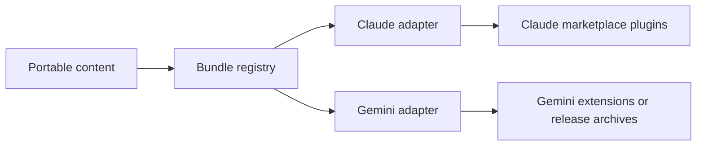

# Architecture

This repository exists to manage reusable agent extensions across two host CLIs that share a `/plugin` (or `/extensions`) discovery model:

- Claude Code
- Gemini CLI

These tools are similar in intent, but they do not share a common packaging or marketplace standard. The architecture in this repository treats that as a first-class constraint.

> Other hosts (Codex, OpenCode, pi.dev) were considered but require external CLI or packaging tooling rather than an in-host install command. They are out of scope for this repo. The `pi-rpc` skill bundled with `dev-tools` is unrelated — it is a runtime client used by Claude Code and Gemini CLI to spawn pi.dev coding agent sessions, not a publication target.

## Problem Statement

We want a single source of truth for reusable agent behavior that can be installed by users of multiple coding agents.

What is portable across hosts:

- Skills written as `SKILL.md` (managed in [`nq-rdl/agent-skills`](https://github.com/nq-rdl/agent-skills), consumed here as a git submodule)
- Prompt content
- Reference material
- Some MCP-backed integrations
- Bundle metadata and release metadata

What is authored in this repo and packaged per host:

- Hooks
- MCP server configurations
- ACP integrations
- Host-specific plugin or extension wiring

What is not reliably portable:

- Hook models
- Permission models
- Runtime plugin code
- Command formats
- Marketplace and install semantics
- Update and governance controls

Because of that, this repository should not try to force a universal plugin format. It should manage a shared catalog of extensions and produce host-native outputs, consuming skills from the submodule by symlink.

## Core Decision

The repository uses this model:


```mermaid
flowchart LR
  A[Portable content] --> B[Bundle registry]
  B --> C[Claude adapter]
  B --> D[Gemini adapter]
  C --> G[Claude marketplace plugins]
  D --> H[Gemini extensions or release archives]
```

The shared abstraction is:

- one catalog
- one bundle registry
- one skills submodule (`nq-rdl/agent-skills`) consumed by symlink
- authored extensions (hooks, MCP, ACP, prompts) in this repo
- multiple native distribution targets

## Platform Nuances

### Claude Code

Claude Code is the most marketplace-native of the four.

- Native install unit: plugin
- Native catalog unit: marketplace
- Good fit for monorepos: yes
- Skills: first-class
- Hooks: first-class and event-rich
- Governance: strong support for allowlists, managed settings, and seeded caches

Implication:

Claude should be treated as the reference marketplace model. Relative-path or `git-subdir` plugin distribution works well for monorepo-managed bundles.

### Gemini CLI

Gemini CLI is extension-native, not marketplace-native.

- Native install unit: extension
- Native discovery model: public gallery crawler over extension repos
- Good fit for monorepos: weaker than Claude and pi
- Skills: supported
- Hooks: supported
- Packaging expectation: self-contained repo or release archive with `gemini-extension.json` at the root

Implication:

Gemini is the main structural mismatch. A central catalog can still exist in this repo, but published Gemini artifacts usually need to become either:

- dedicated extension repos, or
- self-contained release archives

## Comparison Summary

| Tool | Native install unit | Native marketplace? | Monorepo-friendly | Best publication shape |
| --- | --- | --- | --- | --- |
| Claude Code | Plugin | Yes | Yes | Marketplace repo with plugin entries |
| Gemini CLI | Extension | Not really | Limited | Dedicated repo or release archive per extension |

## Proposed Repository Model

The repository should evolve toward this layout:

```text
docs/
  ARCHITECTURE.md
  bundles.md

skills/                    ← git submodule (nq-rdl/agent-skills)

hooks/                     ← hook definitions authored in this repo
mcp/                       ← MCP server integrations authored in this repo
prompts/                   ← prompt content authored in this repo

registry/
  bundles/
    swe.yaml
    infra.yaml
    dataops.yaml
    informatics.yaml
    dev-tools.yaml
    meta.yaml
  channels/
    stable.yaml
    preview.yaml

.claude-plugin/
  marketplace.json         ← Claude Code marketplace manifest (repo root)

plugins/                   ← Claude Code plugins (one per bundle, SELF-CONTAINED)
  swe/
    .claude-plugin/
      plugin.json
    skills/
      tdd/                  ← real-file copy of skills/tdd/
      go-secure/            ← real-file copy of skills/go-secure/

gemini/                    ← Gemini CLI extension (all skills in one extension)
  gemini-extension.json
  GEMINI.md
  skills/
    tdd -> ../../skills/tdd                     ← symlink (in-place link)
    ansible -> ../../skills/ansible
  templates/
  scripts/

dist/
  claude/
  gemini/
```

Notes:

- `skills/` holds real-file content vendored from [`nq-rdl/agent-skills`](https://github.com/nq-rdl/agent-skills) by the `sync-skills.yml` workflow. Skills follow the [agents.io](https://agents.io) standard and are authored and versioned in the upstream repo.
- `hooks/`, `mcp/`, and `prompts/` are the primary authored content of this repository — the extensions themselves.
- **Claude plugins** (`plugins/<bundle>/`) hold **real-file copies** of every skill and agent they ship. Claude Code installs a plugin by `cp -R`-ing its directory into a per-user cache, which preserves symlinks verbatim — and links pointing outside the copied subtree dangle in the cache. Real-file copies make the install self-contained. `scripts/sync-plugins.sh` rebuilds these copies from the canonical `skills/` and `agents/` after upstream changes.
- **Gemini CLI** (`.gemini/`) keeps symlinks because the extension is consumed in-place (`gemini extensions link .`) — there's no copy step that would break the link.
- `registry/` declares bundles, owners, release channels, and target mappings. The `targets:` key in bundle YAML is a logical concept referring to platform outputs, not a filesystem path.
- `.claude-plugin/` and `plugins/` at the repo root form the Claude Code marketplace. Claude Code requires `marketplace.json` at the repo root.
- `gemini/` contains the Gemini CLI extension — adapter templates, build logic, and extension structures.
- `dist/` is generated output and should not be hand-edited.

## Skills Sync

`skills/` is real content vendored from `nq-rdl/agent-skills`. Two mechanisms keep it fresh:

### `sync-skills.yml` — Scheduled and on-demand

Runs weekly (and on `repository_dispatch` from agent-skills releases) to pull the latest content into `skills/`, then runs `scripts/sync-plugins.sh` so `plugins/<bundle>/skills/` matches. Both directories are committed together in the resulting PR — the diff shows skill changes propagated end-to-end.

### `validate.yml` — On every PR / push to main

- Verifies that every skill referenced in `registry/bundles/*.yaml` exists at `skills/<name>/`
- Verifies that every agent referenced exists at `agents/<name>/agent.md`
- Validates plugin manifests (`plugins/<bundle>/.claude-plugin/plugin.json`), hooks, and `.mcp.json` wiring
- Confirms `.gemini/` symlinks resolve (Gemini CLI consumes the extension in-place via `gemini extensions link .`)

## Registry Schema

The registry should describe installable bundles, not raw files.

Recommended shape:

```yaml
schemaVersion: v1
id: swe
displayName: SWE
description: Software engineering workflows and coding assistance bundles.
owners:
  - rdl
channels:
  - stable
  - preview
skills:                        # referenced from skills/ submodule by name
  - developer
  - tdd
  - secure-go
hooks:                         # authored in hooks/ in this repo
  - pre-commit-lint
prompts: []
mcp: []
targets:
  claude:
    enabled: true
    pluginName: swe
    marketplaceName: rdl
  gemini:
    enabled: true
    extensionName: swe
    publication: github-release
    contextFile: GEMINI.md
```

Required behavior of the schema:

- One bundle ID maps to multiple target outputs.
- A target can be disabled without deleting the bundle.
- Target metadata stores install names, publication mode, and channel behavior.
- Skills are referenced by name and resolved from the `skills/` submodule. Agents are referenced by name and resolved from the top-level `agents/` directory in this repo. Hooks, prompts, and MCP integrations are resolved from their respective root-level directories in this repo.

## Agents Primitive

Agents are the second authored primitive (alongside skills) in this catalog. They live at the repo root in `agents/<name>/agent.md` and flow into hosts by symlink, identical in spirit to the skills submodule pattern.

### Scope

Agents are **subagents**: delegatable roles with focused tool allowlists and system prompts that Claude Code auto-routes based on the `description` field. A skill is knowledge that activates contextually; an agent is a role that gets invoked explicitly or by auto-delegation. The two primitives are **orthogonal**: an agent may preload skills via its frontmatter `skills:` list, but neither requires the other to exist.

### Source layout

```
agents/
  <name>/
    agent.md          ← canonical source (flat markdown with YAML frontmatter)
    references/       ← optional; colocated reference material (reserved for future use)
```

`agents/` is **not** part of the `nq-rdl/agent-skills` submodule. It is authored and versioned here — in the same place as hooks, prompts, and MCP servers — so the adapter layer stays co-located.

### Frontmatter schema

The authored frontmatter is a host-agnostic superset. Each host reads the keys it understands; unknown keys are ignored.

```yaml
---
name: <kebab-case>
description: >-
  <delegation trigger; first sentence is Claude Code's match target>
license: MIT
tools:
  - <host-agnostic tool name>   # Read, Edit, Grep, Bash, Write, …
model: inherit                   # Claude Code: 'inherit' | 'opus' | 'sonnet' | 'haiku'
maxTurns: 30                     # Claude Code key
max_turns: 30                    # Gemini CLI key (same value; written explicitly for both)
skills: []                       # Claude Code: optional preload
color: blue                      # optional UI hint
metadata:
  upstream: https://…            # attribution link for forks
  repo: https://github.com/nq-rdl/agent-extensions
---
```

### Flow into hosts

| Host | Discovery path | Symlink shape |
|---|---|---|
| Claude Code | `plugins/<bundle>/agents/<name>.md` (convention-based; no manifest declaration) | **flat file** `.md` real-file copy of `agents/<name>/agent.md` (refreshed by `scripts/sync-plugins.sh`) |
| Gemini CLI | `.gemini/agents/<name>.md` at repo root | **flat file** `.md` symlink pointing to `../../agents/<name>/agent.md` |

The flat-file shape differs from skills (which are directory symlinks). Claude Code's plugin spec expects agents as single `.md` files; the nested source layout exists so future per-agent `references/` sibling directories have a home.

### Attribution

Agents derived from external sources (e.g. `github/awesome-copilot`, MIT) carry two forms of attribution:

1. `metadata.upstream: <url>` in the frontmatter — machine-readable, used to diff against origin on sync.
2. An HTML comment block at the top of the body prose, naming the upstream license and noting any conversion steps (tool namespace rewrite, prose normalization, etc.).

## Build and Generation Rules

The build system should follow these rules:

1. Validate registry entries before generating any target output.
2. Validate authored content (hooks, MCP, prompts) and referenced skills from the submodule.
3. Resolve skill symlinks and generate host-native outputs into `dist/`.
4. Refuse manual edits to generated output during CI.
5. Smoke-test each generated target using the host's native install path where practical.

## CI and Release Design

The CI model should separate validation, generation, and publishing.

### Pull Request Validation

Recommended checks:

- Validate bundle registry schema
- Validate authored content structure and frontmatter
- Verify skill symlinks resolve into the submodule
- Generate all target outputs into a temporary `dist/`
- Diff-check generated output for determinism
- Build docs site

Suggested workflow names:

- `validate.yml`
- `docs.yml`
- `generate-preview.yml`

### Release Workflows

Recommended release stages:

1. Create version tag or release input.
2. Generate target artifacts for all enabled bundles.
3. Publish per target.
4. Publish or update install documentation.

Target-specific publishing model:

- Claude Code: publish or update marketplace content and plugin versions
- Gemini CLI: publish self-contained extension archives or sync generated extension repos

### Release Channels

Use at least two channels:

- `stable`
- `preview`

Channel handling should remain host-native:

- Claude Code: separate marketplace refs, tags, or channels
- Gemini CLI: branch, tag, or pre-release archive

## Exact Install Flows

These are the expected end-user install shapes.

### Claude Code Install Flow

```bash
/plugin marketplace add nq-rdl/agent-extensions
/plugin install swe@rdl --scope project
```

Expected publication target:

- this repository, with `.claude-plugin/marketplace.json` at the root and plugins under `plugins/`

### Gemini CLI Install Flow

Local development (from cloned repo):

```bash
gemini extensions link gemini/
```

Remote install:

```bash
gemini extensions install https://github.com/nq-rdl/agent-extensions
```

Expected publication target:

- one self-contained extension with all skills (single mega-extension)
- remote install via this repo (`gemini-extension.json` at root)

## Language Policy

### Cross-repo scope split

| Asset | Authored in | Distributed from |
|---|---|---|
| `mcp/*-go/` Go MCP servers | this repo | this repo (prebuilt binaries in `plugins/*/bin/mcp/`) |
| `skills/*/scripts/` Go/Python tools | `nq-rdl/agent-skills` | vendored here via submodule |
| `skills/pi-rpc/scripts/Makefile` | `nq-rdl/agent-skills` | vendored here; binaries built by `build-mcp-servers.yml` from `mcp/pi-rpc-go/` |
| `skills/{csv,docx,pdf,xlsx}/scripts/` | `nq-rdl/agent-skills` | runs in-place via `ensure-deps.sh` |
| `plugins/dev-tools/bin/` prebuilt binaries | this repo | committed here, rebuilt by CI |
| `registry/bundles/*.yaml` | this repo | this repo |

**Important**: the `skills/` submodule is owned by `nq-rdl/agent-skills`. Edits made here will be overwritten on the next `sync-skills` PR. File bugs and PRs upstream.

### Per-language rules

| Work type | Language | Rationale |
|---|---|---|
| New CLI helper or MCP server | Go (`CGO_ENABLED=0`, `GOARCH`/`GOOS` matrix) | Zero-install prebuilt binaries; no runtime dep on Bun/Node |
| File-format or ML skill | Python + `ensure-deps.sh` | Direct library access; `ensure-deps.sh` handles bootstrapping |
| Documentation-only skill | Markdown | No execution needed |
| Host-specific plugin wiring | JSON/YAML/shell | Manifests and glue scripts only |
| New TypeScript | Not permitted | Bun hard-dependency, no CI, no binary output path |

### Go house style

Match the style established in `skills/pi-rpc/scripts/` (cobra + `charm.land/fang/v2`, `CGO_ENABLED=0`, `-X main.version=$(git describe)` ldflags). MCP servers in `mcp/*-go/` follow the same Makefile structure with a `cross-compile` target that produces `$(DESTDIR)/<name>-<os>-<arch>` binaries.

### Python / pixi

`pixi` is optional — its only role in this repo is providing a reproducible docs environment (`zensical`) on linux-64. The `pixi.lock` is linux-64 only; macOS contributors should use `uv` directly. Python skill `ensure-deps.sh` scripts (vendored from agent-skills) already walk `pixi > uv > mamba > conda > pip`, so they work without pixi.

### Cross-repo coordination

Upstream issues/PRs to file against `nq-rdl/agent-skills`:

- Add a `cross-compile` target to `skills/pi-rpc/scripts/Makefile` that matches what `build-mcp-servers.yml` invokes for `mcp/pi-rpc-go/`
- Mirror this language policy in agent-skills' own docs once agreed

## Non-Goals

This repository should not try to:

- invent a fake universal runtime that hides all host differences
- flatten hooks into a lowest-common-denominator abstraction
- force Gemini into Claude-style marketplace semantics
- republish to hosts (Codex, OpenCode, pi.dev) whose install model isn't `/plugin`-style — those belong in CLI- or package-driven repos

## Platform Requirements

This repository assumes **macOS and Linux only**. The symlink-based skill resolution strategy depends on native symlink support. Windows users must run under WSL2.

## Design Principles

- Portable content first
- Native distribution second
- Generated outputs over hand-maintained copies
- Explicit host differences over false uniformity
- Install documentation is part of the product

## Near-Term Implementation Order

1. Define the bundle registry format.
2. Create the planned repository layout.
3. Add generators for Claude and Gemini outputs.
4. Add validation and release workflows.
5. Add smoke-test installs for at least one bundle per target.

For contribution expectations and per-tool authoring guidance, see the repository root `CONTRIBUTING.md`.
