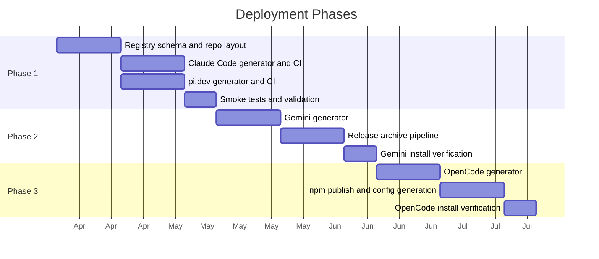

# Deployment Phases

This document describes the phased rollout strategy for multi-platform support. The goal is to reduce operational risk by proving the monorepo model on the most compatible platforms first, then expanding to platforms that require additional infrastructure.

## Phase 1 — Claude Code and pi.dev

**Status:** Not started

**Why these two first:**

- Both are monorepo-native. Claude Code supports relative-path and `git-subdir` plugin distribution. pi.dev supports npm, git, URL, and local path installs.
- No additional infrastructure required beyond what the monorepo already provides.
- Skills, prompts, and references are first-class on both platforms.
- Together they cover the marketplace-native model (Claude) and the package-manager-native model (pi), validating both sides of the distribution spectrum.

**Deliverables:**

1. Define and validate the bundle registry schema (`registry/bundles/*.yaml`).
2. Create the repository layout (`portable/`, `registry/`, `targets/`, `dist/`).
3. Author at least one complete bundle with portable content.
4. Build the generator for Claude Code target output.
5. Build the generator for pi.dev target output.
6. Add CI validation workflow (`validate.yml`).
7. Smoke-test install for Claude Code plugin.
8. Smoke-test install for pi.dev package.

**Exit criteria:**

- One bundle is installable on both Claude Code and pi.dev from generated output.
- CI validates registry schema, portable content, and generated output determinism.

## Phase 2 — Gemini CLI

**Status:** Not started

**Why second:**

- Gemini CLI is the main structural mismatch. It expects a self-contained repo or release archive with `gemini-extension.json` at the root.
- Adding Gemini requires building either a release-archive pipeline (GitHub Releases with per-bundle tarballs) or a mirror-repo sync mechanism (`git-subtree push` or equivalent).
- Delaying Gemini avoids blocking Phase 1 on the most complex distribution target.

**Deliverables:**

1. Build the generator for Gemini CLI target output.
2. Implement release-archive publishing (preferred) or mirror-repo sync.
3. Add Gemini-specific CI steps to validate generated `gemini-extension.json` structure.
4. Add release workflow for Gemini extension archives.
5. Verify install via `gemini extensions install` against a published archive.

**Key decision required:**

Choose between two publication strategies before starting implementation:

- **Release archives:** Attach self-contained extension archives to GitHub Releases. Simpler CI, but requires consumers to reference release URLs.
- **Mirror repos:** Push generated output to dedicated per-bundle repos. Better for Gemini's gallery crawler, but adds infrastructure and sync complexity.

**Exit criteria:**

- At least one bundle is installable via `gemini extensions install` from a published artifact.
- Release workflow produces deterministic, installable Gemini extension archives.

## Phase 3 — OpenCode

**Status:** Not started

**Why last:**

- OpenCode is the least marketplace-shaped of the four targets. Extensions are npm packages registered in `opencode.json`.
- The npm publishing pipeline from Phase 1 (pi.dev) can be reused, reducing incremental effort.
- OpenCode's hook model uses plugin code rather than shell hooks, so the adapter layer may require JS/TS code generation, not just metadata templating.
- Skills are not the same first-class portable primitive as on the other three platforms, so the mapping from portable content to OpenCode output needs the most design work.

**Deliverables:**

1. Build the generator for OpenCode target output (npm package plus `opencode.json` snippet).
2. Handle JS/TS plugin code generation if hooks or runtime extensions are needed.
3. Add OpenCode-specific CI validation.
4. Publish npm package and verify install via `bun add` plus `opencode.json` registration.

**Exit criteria:**

- At least one bundle is installable on OpenCode from a published npm package.
- Generated `opencode.json` snippet is correct and documented.

## Phase Sequencing

## Open Questions

These should be resolved before or during Phase 1:

1. **Build tool choice.** What drives the generators? A Python CLI in `src/agent_extensions/`, a task runner, or standalone scripts? The repo already uses pixi and hatchling, so a Python CLI is the natural fit.
2. **Versioning strategy.** One version for the whole repo, per-bundle versions, or per-target versions? npm targets need semver. Claude marketplace needs version refs.
3. **Adapter template format.** What templating engine for `targets/*/templates/`? Jinja2 is already available in the Python ecosystem and is a reasonable default.
4. **Gemini publication strategy.** Release archives or mirror repos? This must be decided before Phase 2 begins.
